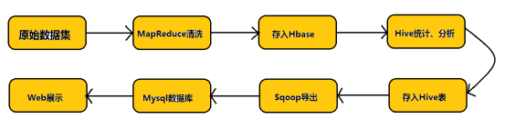

## 介绍

[AirClientWeb](https://github.com/BUGHERE/AirClientWeb)项目是一个航空公司客户数据可视化项目，本项目的技术栈包含 SpringBoot + MyBatis + Thymeleaf + Echarts + Mysql + HDFS + Hive + Sqoop

本项目使用 HDFS + Hive + HBase 技术进行数据处理和存储，并通过 Sqoop 技术将数据存储到 Mysql 数据库中

为了模拟分布式计算环境，我们构建了一个由三台 CentOS 虚拟机组成的集群。在这个集群中，一台虚拟机被配置为主节点，负责协调和管理整个计算流程；其余两台虚拟机则作为从节点，执行具体的计算任务

## 数据

RITA数据集是美国国内商业航班从1987年到2008年航班到达和起飞详细信息的航空公司数据集。该数据集是以逗号分隔的（CSV）格式，拥有大约120万条记录。数据集未压缩格式的磁盘总容量为120 GB。

<!-- 考虑到设备处理性能，我们并没有用这个完整的数据，我们截取其中的一部分（大概6万条数据）进行分析和处理 -->

| 字段名                | 说明                                                                 |
|-----------------------|----------------------------------------------------------------------|
| MEMBER_NO             | 会员编号                                                             |
| FFP_DATE              | 成为常旅客计划会员的日期                                             |
| FIRST_FLIGHT_DATE     | 第一次飞行的日期                                                     |
| GENDER                | 性别                                                                 |
| FFP_TIER              | 常旅客计划等级                                                       |
| WORK_CITY             | 工作城市                                                             |
| WORK_PROVINCE         | 工作省份                                                             |
| WORK_COUNTRY          | 工作国家                                                             |
| AGE                   | 年龄                                                                 |
| LOAD_TIME             | 数据加载时间                                                         |
| FLIGHT_COUNT          | 飞行次数                                                             |
| BP_SUM                | 总积分                                                               |
| EP_SUM_YR_1           | 第一年的累积积分                                                     |
| EP_SUM_YR_2           | 第二年的累积积分                                                     |
| SUM_YR_1              | 第一年的总消费金额                                                   |
| SUM_YR_2              | 第二年的总消费金额                                                   |
| SEG_KM_SUM            | 总飞行公里数                                                         |
| WEIGHTED_SEG_KM       | 加权飞行公里数                                                       |
| LAST_FLIGHT_DATE      | 最近一次飞行的日期                                                   |
| AVG_FLIGHT_COUNT      | 平均飞行次数                                                         |
| AVG_BP_SUM            | 平均积分                                                             |
| BEGIN_TO_FIRST        | 从成为会员到第一次飞行的时间间隔（天）                               |
| LAST_TO_END           | 从最近一次飞行到数据加载时间的时间间隔（天）                         |
| AVG_INTERVAL          | 平均飞行间隔（天）                                                   |
| MAX_INTERVAL          | 最大飞行间隔（天）                                                   |
| ADD_POINTS_SUM_YR_1   | 第一年的累积附加积分                                                 |
| ADD_POINTS_SUM_YR_2   | 第二年的累积附加积分                                                 |
| EXCHANGE_COUNT        | 积分兑换次数                                                         |
| avg_discount          | 平均折扣                                                             |
| P1Y_Flight_Count      | 第一年的飞行次数                                                     |
| L1Y_Flight_Count      | 最近一年的飞行次数                                                   |
| P1Y_BP_SUM            | 第一年的累积积分                                                     |
| L1Y_BP_SUM            | 最近一年的累积积分                                                   |
| EP_SUM                | 总累积积分                                                           |
| ADD_Point_SUM         | 总累积附加积分                                                       |
| Eli_Add_Point_Sum     | 可兑换的累积附加积分                                                 |
| L1Y_ELi_Add_Points    | 最近一年的可兑换累积附加积分                                         |
| Points_Sum            | 总积分                                                               |
| L1Y_Points_Sum        | 最近一年的总积分                                                     |
| Ration_L1Y_Flight_Count | 最近一年的飞行次数占比                                             |
| Ration_P1Y_Flight_Count | 第一年的飞行次数占比                                               |
| Ration_P1Y_BPS        | 第一年的积分占比                                                     |
| Ration_L1Y_BPS        | 最近一年的积分占比                                                   |
| Point_NotFlight       | 非飞行积分   
